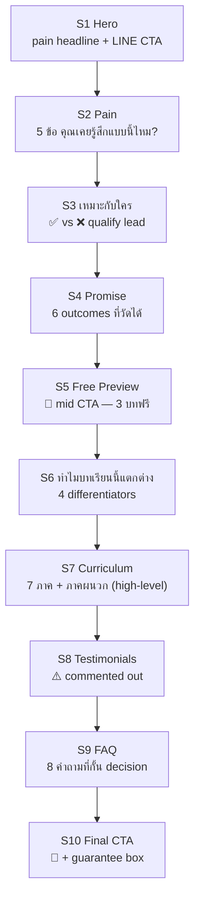

# 02 — Sales Page Spec

<aside>
📄

**เป้าหมาย**: หน้านี้คือ "ห้องเรียนหน้าเดียว" — สอนให้คนเห็นปัญหาตัวเอง แล้วเลือกแอด LINE เพื่ออ่าน 3 บทแรกฟรี (ไม่มีปุ่มชำระเงินบนหน้านี้)

**Stack**: Next.js 15 App Router + Tailwind + Framer Motion + Vercel

**URL**: `phachara.com/` (root)

</aside>

<aside>
🟢

**Build Status (9 พ.ค. 02:00)**: ✅ Phase 1-3 เสร็จ — 17 commits (C0-C3 + B1-B17), Lighthouse mobile 99/95/96/100, merged to main, deploy [phachara.com](http://phachara.com) แล้ว

**Phase 4 (กำลังทำ)**: revise copy ตาม Writing Style Guide — Claude Code จะรัน B18-B27 (1 commit ต่อ section)

**Source of truth**: หน้านี้ + [](https://www.notion.so/a95f585940e548039acd4f73a28b8674?pvs=21) — ห้ามแต่งคำใหม่นอกเหนือจากนี้

**Reference**: [Writing Style Guide — "แค่เปลี่ยนคำ ก็ทำเงิน"](https://www.notion.so/Writing-Style-Guide-c994185b91a046dab4c66e911a672a8f?pvs=21) + [E. ตารางคำต้องห้าม vs คำที่ควรใช้](https://www.notion.so/E-vs-6a31fa314b2e4a0b8afb2ff73446b20d?pvs=21)

</aside>

## 🎨 หลักการใช้คำ (Tone & Voice)

1. **เป็นกันเอง + ตรงไปตรงมา** — เหมือนพี่สอนน้อง ไม่ใช่อาจารย์สอนนักศึกษา
2. **ภาษาคนจริง** — "ทำไมลูกค้าอ่านจบแล้วไม่ซื้อ?" ไม่ใช่ "ปัจจัยที่ส่งผลต่อการตัดสินใจซื้อ"
3. **กล้าพูดตรง** — ใช้ประโยคที่ท้าทาย เช่น "ปัญหาไม่ใช่ที่คุณ — ปัญหาคือคำที่ใช้"
4. **ใช้ "บทเรียน" แทน "คอร์ส"** ทุกที่บนหน้านี้
5. **ตัวเลขเฉพาะเจาะจง** — "24 บท" ไม่ใช่ "หลายบท" / "5 หมวด" ไม่ใช่ "หลากหลาย"
6. **ทุกหัวข้อต้อง "อ่านแล้วอยากอ่านต่อ"** — ไม่ใช่แค่บอกว่ามีอะไร

## 🔧 Decisions Made During Rebuild (8-9 พ.ค.)

| เรื่อง | เปลี่ยนเป็น | เหตุผล |
| --- | --- | --- |
| โครงสร้างหน้า | **9 → 10 sections** (เพิ่ม S3 "เหมาะกับใคร") | Qualify lead ก่อนนำเสนอ |
| S2 Pain | **3 → 5 ข้อ** (เพิ่ม "ลดราคาแล้วยังเงียบ" + "เคยซื้อคอร์สอื่นแล้วยังเขียนไม่เป็น") | ขยาย mirror ให้ครอบคลุม pain คนไทยมากขึ้น |
| S6 (เดิม Author/ผู้แปล) | **"ทำไมบทเรียนนี้ถึงแตกต่าง"** (4 differentiators) | เลี่ยงข้อมูลส่วนตัวที่ยังไม่พร้อม + เน้น product trust |
| S7 Curriculum | **7 ภาค + ภาคผนวก + รายชื่อบท 24 บท + ภาคผนวก A-E — expanded ไม่มี toggle** (revised 9 พ.ค. 02:50) | โปร่งใสกว่า + มือถือไม่ต้องคลิกเปิด — scroll เดียวเห็นครบ, ลด friction |
| คำเรียกสินค้า | **"คอร์ส" → "บทเรียน"** ทั่วทั้งหน้า | โทนถ่อมตัว + เข้ากับ "พี่สอนน้อง" |
| S7 Testimonials | Comment out (เหมือนเดิม) | รอ real quotes หลัง soft launch |

## 📑 10-Section Architecture



## 🗂️ Sticky CTA (always-on)

<aside>
📌

ตำแหน่ง: **bottom of viewport** (mobile) / **right floating** (desktop ≥ md)

Copy หลัก: **"แอด LINE รับ 3 บทฟรี"**

Copy รอง: "ไม่ต้องสมัคร · อ่านได้เลย"

Behavior: hide ตอนอยู่ S1 — show เมื่อ scroll > 100vh

Deep link: `https://lin.ee/049vlbwy?utm_source=sp&utm_medium=sticky`

</aside>

---

## S1 — Hero (above fold)

**Layout**: 60% copy / 40% book mockup (desktop) — stacked (mobile)

**Headline (H1)**:

> โพสต์ทุกวัน ยิงแอดทุกคืน
ทำไมยังไม่มีคนกดซื้อ?

**Sub (H2 size, body weight)**:

> ปัญหาไม่ได้อยู่ที่สินค้า ไม่ได้อยู่ที่กราฟิก
ปัญหาอยู่ที่ **"คำ"** ที่คุณใช้ — แค่เปลี่ยนคำให้ตรงจุด ยอดขายเปลี่ยนทันที
**บทเรียน "แค่เปลี่ยนคำ ก็ทำเงิน"** — 24 บท + ภาคผนวก 5 ส่วน ที่กรอกคำได้ทันที

**Primary CTA (button)**: 🟢 **แอด LINE รับ 3 บทแรกฟรี**

**Secondary line**: ไม่ต้องสมัครสมาชิก · ไม่ขอ email · อ่านได้เลย

**Trust strip** (ใต้ปุ่ม): 📚 24 บท + ภาคผนวก 5 ส่วน · 🛡 คืนเงิน 7 วัน · 🔒 PDPA

---

## S2 — คุณเคยรู้สึกแบบนี้ไหม? (5 ข้อ)

**Headline**: คุณเคยรู้สึกแบบนี้ไหม?

**Card layout** (5 cards):

1. 📉 **"ยิงแอดมาทั้งเดือน คนทักเยอะ — แต่ยอดเงินยังนิ่ง"**
ค่าโฆษณาเผาทุกวัน Engagement สวย แต่กล่องเงินไม่ขยับ
2. 😶 **"คนกดเข้าหน้าเพจแล้วเงียบ ไม่ทักไม่ซื้อ"**
Traffic เข้ามาแล้ว แต่เลื่อนผ่านไปเฉย ๆ ไม่มีอะไรให้หยุด
3. 🤯 **"เขียนเองก็ไม่ได้ จ้างคนเขียนก็แพง"**
ติดตรงกลาง — ไม่รู้จะเริ่มจากตรงไหน ใช้คำไหนดี
4. 💸 **"ลดราคาแล้วเงียบ จัดโปรแล้วก็ยังเงียบ"**
ลดจน margin บางแล้วยังขายไม่ออก เพราะปัญหาไม่ใช่ราคา
5. 🔄 **"เคยซื้อคอร์สมาแล้วหลายตัว แต่ยังเขียนไม่เป็น"**
เรียนแล้วทำตามไม่ได้ — เพราะตำราเป็นภาษาฝรั่ง ไม่เข้ากับตลาดไทย

**Closer**:

> ปัญหาไม่ใช่ที่คุณ — ปัญหาคือ **"คำ"** ที่ใช้ยังไม่ทริกเกอร์การตัดสินใจของคนซื้อ
และเราจะเปลี่ยนตรงนี้ทั้งหมด

---

## S3 — บทเรียนนี้เหมาะกับใคร (NEW)

**Headline**: บทเรียนนี้เหมาะกับใคร?

**Layout**: 2 คอลัมน์ (desktop) / stack (mobile) — ✅ vs ❌

### ✅ เหมาะกับคุณถ้า...

- ขายของออนไลน์อยู่แล้ว แต่ยอดไม่นิ่ง — เดือนนี้ดี เดือนหน้าหาย
- เป็นเจ้าของแบรนด์เล็ก ไม่มีงบจ้าง copywriter เดือนละ 30,000+
- ยิงแอด FB/TikTok เอง อยากให้ ROAS ดีขึ้นด้วยการเปลี่ยนคำ ไม่ใช่เพิ่มงบ
- อยากเขียนแคปชั่นที่คนอ่านแล้วทักมาเอง ไม่ต้องไล่ตามลูกค้า
- เปิดร้านใหม่ อยากปิดยอดแรกใน 30 วัน
- ใช้ AI ช่วยเขียนอยู่แล้ว แต่ output ยัง "ดูเป็น AI" คนอ่านปุ๊บรู้ทันที

### ❌ ยังไม่เหมาะถ้า...

- มองหาบทเรียนสอนยิงแอด FB Ads / Google Ads (เล่มนี้ไม่ได้สอน)
- มองหาบทเรียนทำเว็บ / SEO / Analytics
- คาดหวังจะรวยใน 7 วัน — เล่มนี้ให้ "สูตร" ที่ต้องลงมือทำ
- ไม่พร้อมเปิดโพสต์ขึ้นมาลองเขียนอย่างน้อยสัปดาห์ละ 3 ครั้ง

**Mini-CTA**: ตรงกับคุณข้อใดข้อหนึ่งใช่ไหม? → แอด LINE รับ 3 บทฟรี

---

## S4 — Promise (หลังอ่านจบ คุณจะ...)

**Headline**: หลังอ่านจบ 24 บท คุณจะ...

**Checklist** (6 outcomes ที่วัดได้):

- ✅ มี **Hook 12 ตระกูล** + 50 สูตร พร้อมใช้กับสินค้าตัวเอง
- ✅ รู้ **โครง 4 ส่วน** ที่ทำให้โพสต์/หน้าเพจ/Landing Page ปิดได้
- ✅ มี **คำเฉพาะ 100+ คำ** ภาษาไทย ที่กระตุ้น action ได้จริง
- ✅ ปรับ **CTA** ให้ click rate เพิ่ม 2-5 เท่าได้ทันทีจากบทที่ 9
- ✅ มี **Swipe File** อีเมล/แคปชั่น/Landing Page ที่ก๊อปไปปรับชื่อสินค้าได้เลย
- ✅ ใช้ **AI Prompt 30 ชุด** ให้เขียนงานคุณภาพมือโปรในเวลา 15 นาที

**Mini-CTA**: อยากดูตัวอย่างก่อน? → แอด LINE รับ 3 บทแรก

---

## S5 — 🎁 Free Preview (mid-page CTA)

**Layout**: callout box เด่น สีเขียว LINE

**Headline**: ลองอ่าน 3 บทแรกก่อน — ฟรี ไม่ต้องสมัคร

**Body**:

> เพราะเรามั่นใจว่าสูตรในเล่มนี้ใช้ได้กับธุรกิจไทยจริง — ไม่ใช่ตำราฝรั่งที่แปลตรง ๆ มา
**กดแอด LINE OA** → รับ 3 บทแรกทันที (~30 หน้า)
อ่านแล้วเอาไปลองปรับงานคุณก่อน — ถ้าเห็นผล ค่อยมาเรียนต่อ ถ้าไม่ใช่ก็ไม่เป็นไร

**Big button**: 🎁 **แอด LINE รับ 3 บทฟรี (PDF)**

**Sub**: บท 1 "ทำไมคนเขียนเก่งกว่าคุณ ขายได้น้อยกว่าคุณ" + บท 2 "คนซื้อด้วยอารมณ์ แล้วค่อยหาเหตุผลทีหลัง" + บท 3 "4 ปมในใจ ทำให้คนยอมจ่าย โดยไม่ทันคิด"

---

## S6 — ทำไมบทเรียนนี้ถึงแตกต่าง (REPLACES Author)

**Headline**: แล้วเล่มนี้ต่างจากคอร์สอื่นยังไง?

**Layout**: 4 cards (icon + headline + 1-2 lines)

### 🇹🇭 1. ตัวอย่างทุกอันเป็น "ภาษาไทย" จริง

ไม่ใช่ Apple / Tesla / Coca-Cola — แต่เป็นเซรั่มสิว ครีมกันแดด อาหารหมา รับสร้างบ้าน คอร์สออนไลน์ ทุกตัวอย่างจากตลาดไทยที่คุณขายอยู่จริง

### 📐 2. มี "สูตร" ให้กรอกคำได้ทันที

ไม่ใช่แนวคิดลอย ๆ — ทุกบทมีโครงให้กรอก เปิดมาก็ใช้ได้เลย ไม่ต้องตีความ ไม่ต้องคิดเอง

### 🤖 3. เขียนคู่กับ AI ได้

24 บทออกแบบให้ใช้ร่วมกับ ChatGPT/Claude — มี Prompt 30 ชุดที่ทดสอบจริง ไม่ใช่บอกแค่ "ลองถาม AI ดูสิ"

### 💸 4. ลงทุนครั้งเดียว ใช้ได้ตลอดชีพ

ไม่ใช่ subscription รายเดือน — จ่าย 990 บาทครั้งเดียว อัปเดต lifetime เพิ่มบทใหม่ฟรี

**Closer**:

> ถ้าอยากได้ "คู่มือเขียนคำที่ทำให้คนซื้อ ในบริบทตลาดไทย" — เล่มนี้คือเล่มที่คุณกำลังหา

---

## S7 — เนื้อหา 7 ภาค + ภาคผนวก (revised 9 พ.ค. — เพิ่มรายชื่อบท)

**Headline**: เนื้อหา 24 บท แบ่งเป็น 7 ภาค + ภาคผนวก

**Section list — expanded, ไม่มี toggle** — 8 sections แสดงพร้อมกัน. แต่ละ section: หัวภาค (icon + ชื่อภาค) + summary 1 บรรทัด + bulleted list ของบท (เลขบท + ชื่อบท verbatim จาก ebook v.2). **ไม่มีคำอธิบายต่อบท** — เห็นแค่ชื่อ

### 🧠 ภาค 1 — จิตวิทยาผู้ซื้อ

เข้าใจว่าทำไมคนถึงยอมจ่าย "ปม" อะไรในใจที่ทำให้กดซื้อ และทำไมคนซื้อด้วยอารมณ์ก่อนเหตุผล

- บท 1 — คนซื้อด้วยอารมณ์ แล้วค่อยหาเหตุผลทีหลัง: Buyer Psychology
- บท 2 — 4 ปมในใจ ทำให้คนยอมจ่าย โดยไม่ทันคิด
- บท 3 — สูตรขายอายุ 100 ปี ที่ยังได้ผลในยุค TikTok
- บท 4 — จงให้คำสัญญากับลูกค้า แต่อย่าโกหก

### 📊 ภาค 2 — วัดผลคำที่เขียน

รู้วิธีตรวจว่าคำของคุณ "ใช้ได้จริง" หรือแค่คิดไปเอง ด้วย 4 ตัวเลขที่บอกผลทันที

- บท 5 — 5 จุดที่สมองคนตัดสินว่า "ดูต่อ" หรือ "เลื่อนผ่าน"
- บท 6 — "คำ" ที่คุณเขียน ใช้ได้แล้วหรือยัง

### 🎣 ภาค 3 — Hook ที่หยุดคนเลื่อน

คลัง Hook 12 ตระกูล + 50 สูตร พร้อมตัวอย่างแคมเปญไทยจริง — ผสม Hook 2-3 แบบให้แรงทวีคูณ

- บท 7 — อย่าเปิดประโยคด้วย "สวัสดีครับ"
- บท 8 — Hook คือเหยื่อล่อปลา ไม่ใช่บทเกริ่นนำ แยกให้ออก
- บท 9 — 12 สูตร Hook สับไก เปิดใจคนปี 2026
- บท 10 — เคล็ดผสม Hook 2-3 แบบใน 1 ประโยค ให้แรงทะลุจอ
- บท 11 — ประโยคที่ 2 ของเนื้อหา พาให้คนอ่านต่อ

### 📐 ภาค 4 — โครงเขียนเต็มฟอร์แมต

สูตรเขียน 3 รูปแบบ: โพสต์ขาย / สคริปต์คลิปสั้น 60 วิ / Landing Page 9 ส่วน

- บท 12 — 8 โครงโพสต์สะกดจิตคน ที่ทำให้อ่านจบและทำตาม
- บท 13 — คลิปสั้น 60 วิ: สคริปต์แบบไหน ที่คนยอมหยุดดู
- บท 14 — หน้าเดียวทำเงิน: ชำแหละ Landing Page ที่ปิดยอดได้จริง

### ✨ ภาค 5 — คำที่ทรงพลัง

Call-out Words ที่ทำให้คน "รู้สึกว่าพูดถึงตัวเอง" + คำลดแรงต้านมือใหม่ + คำพรีเมียม + พลังของตัวเลข

- บท 15 — คำที่คนอ่านแล้วรู้สึกว่า "พูดถึงฉัน": Call-out Words
- บท 16 — คำที่เปลี่ยนคนลังเล เป็นคนกล้าโอน
- บท 17 — ภาษา Premium: อัปราคาให้แพง แต่คนแย่งกันจ่าย
- บท 18 — พลังแห่งตัวเลข: เปลี่ยนคำลอย ๆ ให้กลายเป็นความน่าเชื่อ

### 🎯 ภาค 6 — ปิดการขายในข้อความเดียว

หลักฐาน 7 แบบที่นักขายตัวเล็กก็ใช้ได้ + Offer ที่ปฏิเสธยาก + 12 ประโยคปิดท้ายโดยไม่ต้องพูดว่า "ซื้อเลย"

- บท 19 — หลักฐาน 7 ชิ้น ที่แบรนด์เล็กก็ชนะแบรนด์ใหญ่ได้
- บท 20 — เขียน Offer ข้อเสนอสุดต้านทาน: ไม่ซื้อตอนนี้คือพลาด!
- บท 21 — 12 ประโยคปิดท้าย โดยไม่ต้องพูดว่า "ซื้อเลย"

### 🤖 ภาค 7 — AI เป็นผู้ช่วย

Prompt 5 ขั้นที่ทำให้ AI เขียนระดับมือโปร + Workflow ครบลูปตั้งแต่ไอเดียจนถึงปิดยอด

- บท 22 — สูตร Prompt 5 ขั้น: เปลี่ยนมือใหม่เป็นมือโปร
- บท 23 — 5 ชุด Prompt ที่นักขายต้องมี: Hook / Script / Landing / QC / คู่แข่ง
- บท 24 — Workflow ใช้ AI ตั้งแต่ไอเดีย จนถึงปิดยอด

### 📎 ภาคผนวก (5 เครื่องมือพร้อมใช้)

- A. เช็กลิสต์ตรวจงานก่อนปล่อย (Hook / Proof / CTA)
- B. 100+ Template ครบทุกฟอร์แมต กรอกคำได้ทันที
- C. 50+ Hook Formulas พร้อมตัวอย่างไทย
- D. Prompt Library 30 ชุด พร้อมตัวอย่างใช้จริง
- E. ตารางคำต้องห้าม vs คำที่ควรใช้ (100+ คู่)

**Data source**: hardcoded ใน `components/sections/S6Curriculum.tsx` (verbatim จาก Notion ebook v.2 — ห้ามแต่งเอง)

**Mini-CTA**: อยากอ่านเนื้อหาบางส่วนก่อน? → แอด LINE รับ 3 บทแรกฟรี

---

## S8 — Testimonials ⚠️ COMMENTED OUT (Build decision 8 พ.ค.)

<aside>
⚠️

**Status**: Section นี้ comment out ทั้งหมดในโค้ด — รอ real quotes หลัง soft launch (≥ 5-10 testimonials จริง)

**ห้าม render placeholder/fake/stock** — กฎ honest persuasion (S8 ไม่มี ดีกว่า S8 ปลอม)

**Restore เมื่อ**: มี ≥5 quotes จาก customer จริง พร้อม consent ให้ใช้ชื่อ/ภาพ

</aside>

**Layout เมื่อ restore**: 3-card carousel + photo (or initial+name+job)

---

## S9 — FAQ (8 คำถาม)

**Format**: toggle list (ใช้ `<details>` element)

1. **เป็นไฟล์ PDF หรือมีแอป?**
อ่านใน LINE (Web LIFF) + ดาวน์โหลด PDF ได้ — เปิดอ่านบนมือถือได้เลย ไม่ต้องลงแอปเพิ่ม
2. **ราคา 990 บาท รวมอะไรบ้าง?**
24 บท + 5 ภาคผนวก (Template + Hook + Prompt + คำต้องห้าม + แผน 30 วัน) + อัปเดต lifetime
3. **คืนเงินได้ไหม?**
ได้ภายใน 7 วัน ถ้าอ่านไม่ถึง 3 บท — ส่งคำว่า "คืนเงิน" ใน LINE คืนให้ภายใน 24 ชม.
4. **ต้องเขียนเป็นมาก่อนไหม?**
ไม่ต้อง — ออกแบบมาให้คนทำธุรกิจที่ไม่ใช่นักเขียนเรียนได้ ทุกบทมีสูตรให้กรอก
5. **ใช้เวลาเรียนนานแค่ไหน?**
24 บท × 10-15 นาที/บท = ประมาณ 5 ชม. เรียนเสร็จใน 1 สัปดาห์ + เริ่มลองใช้ได้ตั้งแต่บท 7
6. **ใช้กับธุรกิจอะไรได้บ้าง?**
สินค้า, บริการ, บทเรียนออนไลน์, e-commerce, B2B — ทุกอย่างที่ต้องเขียนขาย ตัวอย่างในเล่มมีทั้งสกินแคร์ อาหารหมา รับสร้างบ้าน บทเรียนออนไลน์
7. **จ่ายผ่านอะไรได้บ้าง?**
PromptPay (QR) หรือ บัตรเครดิต/เดบิต ผ่าน Stripe — ปลอดภัยตามมาตรฐาน PCI
8. **ข้อมูลส่วนตัวเก็บอะไรบ้าง?**
เก็บแค่ LINE userId (ไม่มี email/เบอร์/บัตรประชาชน) — ลบได้ทุกเมื่อ ส่งคำว่า "ลบข้อมูล" ใน LINE

---

## S10 — Final CTA + Guarantee

**Headline**: พร้อมเริ่มหรือยัง?

**Recap (3 lines)**:

- 24 บท + ภาคผนวก 5 ส่วน — ใช้ได้ตลอดชีพ
- คืนเงินภายใน 7 วัน ไม่ถามเหตุผล
- เริ่มจาก 3 บทฟรีก่อน — แอด LINE

**Big button**: 🟢 **แอด LINE รับ 3 บทฟรี**

**Below — Guarantee box** 🛡:

> ถ้าอ่านแล้วไม่คุ้ม คืนเงินเต็ม 990 บาท ภายใน 7 วัน
แค่ส่งคำว่า "คืนเงิน" ใน LINE — ไม่ต้องอธิบายเหตุผล โอนคืนภายใน 24 ชั่วโมง

---

## 🛠️ Tech Spec

### Tech stack

- **Framework**: Next.js 15 App Router (RSC by default)
- **Style**: Tailwind v4 + utility-first, no CSS-in-JS
- **Fonts**: `Noto Sans Thai Looped` (body) + `Noto Serif Thai` (display H1)
- **Images**: `next/image` + AVIF, mockup 3 sizes responsive
- **Animation**: Framer Motion เฉพาะ hero + sticky CTA reveal เท่านั้น
- **No JS frameworks** สำหรับ section อื่น — pure RSC + minimal client comp

### Routes

- `/` — main SP (10 sections)
- `/legal/refund`, `/legal/privacy`, `/legal/terms`, `/legal/cookie`

### Tracking events

- `sp_view`, `sp_scroll_50`, `sp_scroll_90`
- `sp_cta_click` (with `position: hero|s5|s10|sticky`)
- `sp_line_redirect`

## 📐 Mobile Wireframe (10 sections)

```jsx
┌──────────────────┐
│  [logo]    ☰    │
├──────────────────┤
│  S1 H1 PAIN      │
│  📦 mockup        │
│  🟢 แอด LINE       │
│  ⭐ trust         │
├──────────────────┤
│  S2 5 PAIN cards │
├──────────────────┤
│  S3 ✅ ❌ qualify │
├──────────────────┤
│  S4 6 outcomes   │
├──────────────────┤
│  S5 🎁 PREVIEW    │ ← mid CTA
├──────────────────┤
│  S6 4 different  │
├──────────────────┤
│  S7 7+1 toggles  │
├──────────────────┤
│  S8 (hidden)     │
├──────────────────┤
│  S9 FAQ 8 toggle │
├──────────────────┤
│  S10 🟢 + 🛡       │
└──────────────────┘
[🟢 sticky bottom: "แอด LINE รับ 3 บทฟรี"]
```

## ✅ Build Checklist (Phase 4 — copy revision)

### ✅ Phase 1-3 Done (B1-B17)

- [x]  Layout shell + Noto fonts — `B1`
- [x]  LINE URL helper + analytics — `B2`
- [x]  LineCTAButton + StickyLineCTA — `B3 / B4`
- [x]  S1-S9 sections wired (old 9-section structure) — `B5-B12`
- [x]  page.tsx wired + Contact LINE-first — `B13 / B14`
- [x]  SEO + manifest + AnalyticsInit — `B15 / B16`
- [x]  Perf fix (LCP 2.1s) — `B17`
- [x]  Lighthouse mobile 99/95/96/100 ✓
- [x]  Merged to main

### ⏳ Phase 4 — Copy Revision (B18-B27)

- [ ]  **B18**: replace global "คอร์ส" → "บทเรียน" + global tone pass per Style Guide
- [ ]  **B19**: S1 Hero rewrite (new H1 + sub + trust strip)
- [ ]  **B20**: S2 Pain expand 3 → 5 cards
- [ ]  **B21**: S3 "เหมาะกับใคร" — NEW component (✅ vs ❌ 2-column)
- [ ]  **B22**: S4 Promise — 6 outcomes (jiggled order + new bullet for AI)
- [ ]  **B23**: S5 Preview rewrite (3-chapter teaser update)
- [ ]  **B24**: S6 "ทำไมบทเรียนนี้ต่าง" — REPLACE old AuthorSection (4 differentiator cards)
- [ ]  **B25**: S7 Curriculum simplify (remove ch numbers, keep 7+1 groups summary)
- [ ]  **B26**: S9 FAQ rewrite (more conversational tone, 8 questions)
- [ ]  **B27**: S10 Final CTA + Guarantee box rewrite
- [ ]  Re-run Lighthouse (gate ≥ 95 mobile)
- [ ]  Push to main → Vercel auto-deploy

---

**Next**: [[phachara.com](http://phachara.com) — Project Hub](https://www.notion.so/phachara-com-Project-Hub-8b374c29ae804eceb8a816fc40ba92ca?pvs=21) · ส่ง Claude Code prompt B18-B27 (continuous mode)